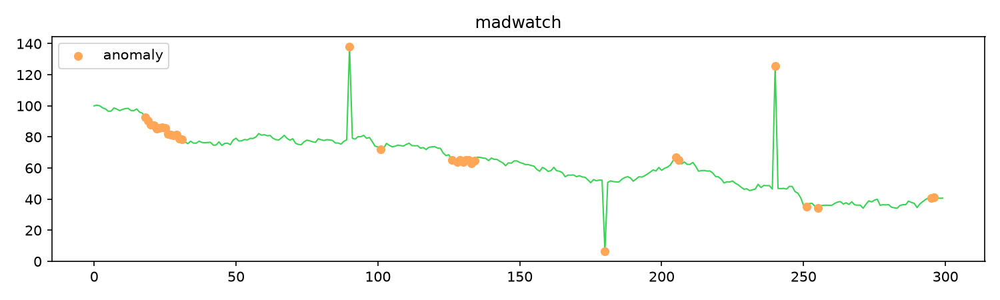
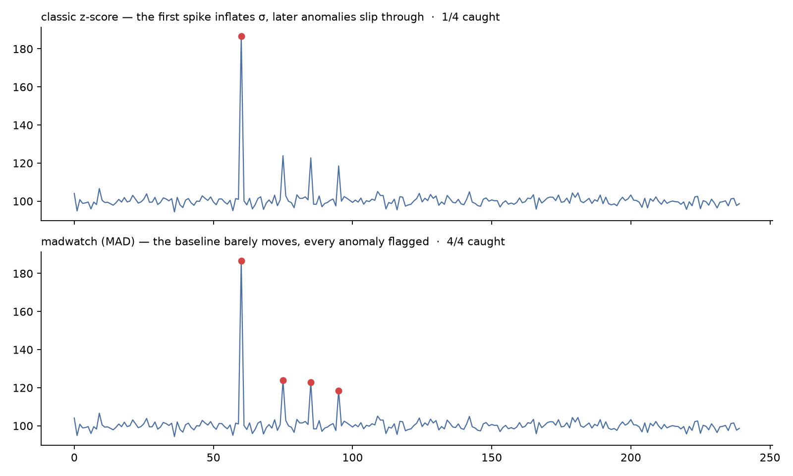

# madwatch

[](https://github.com/efekckk/madwatch/actions/workflows/ci.yml)
[](https://pypi.org/project/madwatch/)
[](https://pypi.org/project/madwatch/)
[](LICENSE)

Robust anomaly detection that doesn't panic at paydays.

`madwatch` scores time-series values with the **Modified Z-Score over MAD**
(Median Absolute Deviation) instead of mean/standard deviation. Medians don't
care about your whale transaction: one huge outlier can't inflate the baseline
and mask the next real anomaly.



## Install

```bash
pip install madwatch        # core, numpy only
pip install 'madwatch[cli]' # + CLI, pandas, matplotlib
```

## Quickstart

```python
from madwatch import RollingDetector

det = RollingDetector(window=40, threshold=3.5, min_samples=10)
for value in stream:
    score = det.update(value)
    if score.is_anomaly:
        alert(value, score.z)
```

## Why MAD?

Standard deviation has a design flaw for anomaly detection: the anomaly you are
trying to catch is *inside* the calculation. One spike inflates sigma, the
threshold stretches, and the next three real anomalies walk through undetected.
MAD is median-based, so a single outlier in the window barely moves the
baseline. The `0.6745` constant makes the score comparable to a classic z-score
on normal data, so the usual "flag at 3.5" rule still reads naturally.



Same series, same 3.5 threshold ([examples/make_comparison_plot.py](examples/make_comparison_plot.py)):
the classic z-score catches the whale and then goes blind while it sits in the
window; MAD flags all four.

Longer version: [Why MAD instead of standard deviation?](https://efekckk.github.io/blog/why-mad)

## Seasonal baselines

Mondays don't look like Saturdays and 9 AM doesn't look like midnight. Comparing
a value against a global baseline produces false alarms at every weekly rhythm.
`SeasonalBaseline` buckets history by day-of-week and/or hour and scores each
point against its own bucket:

```python
from madwatch import SeasonalBaseline

sb = SeasonalBaseline(granularity="dow_hour").fit(timestamps, values)
z = sb.score(new_timestamps, new_values)
```

In production use on financial streams, this combination cut false positives by
roughly 60% compared to a naive z-score.

## CLI

```bash
madwatch data.csv --column amount --window 40 --threshold 3.5 --plot out.png
madwatch data.csv --column amount --timestamp ts --seasonal dow_hour
```

```
where                        value         z
2026-02-07T12:00:00         512.00      9.41
1 anomalies in 312 points
```

## API

| Name | What it does |
|---|---|
| `mad(x)` | Median Absolute Deviation of an array |
| `modified_zscore(x, scale=0.6745)` | Per-element robust z-score |
| `RollingDetector(window, threshold, min_samples)` | Streaming detection over a trailing window |
| `SeasonalBaseline(granularity)` | Per-bucket (dow/hour) baselines with global fallback |

Behavior notes: constant windows (MAD = 0) score `z = 0`; the detector stays
silent until `min_samples` values have arrived; `NaN` input raises `ValueError`
(the CLI skips NaN rows with a warning).

## Development

```bash
uv venv && uv pip install -e '.[dev]'
pytest
ruff check src tests
```

## License

MIT
